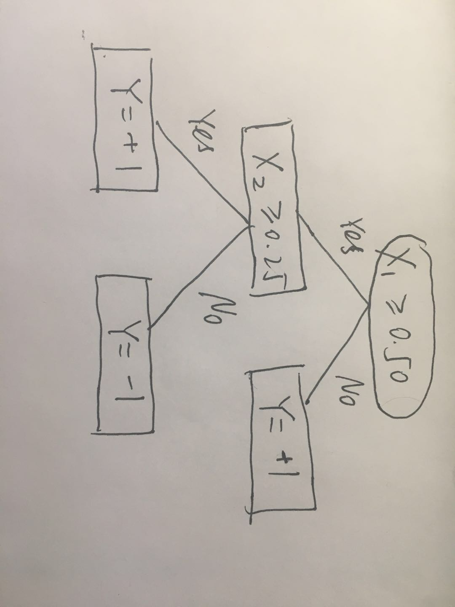

```{r setup, include=FALSE}
knitr::opts_chunk$set(echo = FALSE)
library(dplyr)
library(ggplot2)
library(caret)
library(rpart.plot)
library(randomForest)
library(knitr)
```

#1 Classifiers for Basketball Courts

##a

```{r}
#oberserved shots
shots = data.frame(x1=c(.75,.85,.85,.15,.05,.05,.85),
                   x2=c(.10,.80,.95,.10,.25,.50,.25),
                   y=c(-1,-1,1,-1,1,1,-1))
shots.data = shots[,c(1,2)] %>% as.matrix()
shots.label = shots[,3] %>% as.matrix()

#perceptron algorithm from HW1
perceptron = function(x, y, epoch) {
        # initialize weight vector
        weight = rep(0, dim(x)[2])
        result = matrix(0, nrow = epoch, ncol = dim(x)[2])
        for (i in 1:epoch) {
                for (j in 1:length(y)) {
                        z = sum(weight*x[j, ])
                        if(z <= 0) {
                                ypred = -1
                        } else {
                                ypred = 1
                        }
                        
                        # Update weight
                        if (y[j] != ypred) {
                          weight = weight + y[j] * x[j,]
                        }
                }
          #save weight vectors for each step
          result[i,] = weight
        }
        return(result)
}
```

```{r}
weight = perceptron(shots.data, shots.label,100)
pred.train = t(shots.data %*% t(weight))
pred.train[pred.train>0] = 1
pred.train[pred.train<=0] = -1
accuracy = apply(pred.train, 1, function(x) {return(sum(x==shots.label)/length(shots.label))})
accuracy = c(0,accuracy)
#plot accuracy vs. epoch
plot(x = 0:100, y=accuracy, ylim = range(0,1), type = "l", col = "blue", xlab = "epoch", ylab = "accuracy")
```

From the epoch vs. accuracy plot, we can see the perceptron converges at 37th iteration. Since the accuracy is 100%, there's no empirical error for this classifier. We can come up with other linear classifiers which will give the same error(0). For example, an boolean function $y = f(x_1,x_2) = \mathbb{I}_{-x_1+x_2>0}$. More generally, as long as the slope of the linear classifier passing through origin is between $(\frac{16}{17},\frac{19}{17})$.

```{r}
#plot observed data and another seperation line
ggplot(shots) + geom_point(aes(x = x1, y = x2, col = as.factor(y)))+
  theme_bw() + geom_abline(slope = -weight[100,1]/weight[100,2], color = 'red') + 
  geom_abline(slope = 1, intercept = 0, color = 'blue') + 
  stat_function(fun=function(x) sqrt(x), xlim = c(0,1))
```

The above plot shows data and the decision boundary of the perceptron (as red line). In addition, the boolean function $y = f(x_1,x_2) = \mathbb{I}_{-x_1+x_2+0.08>0}$ is also plotted as a black line, which clearly seperates our data with no empirical error.

##b

```{r}
#split the decision tree based on gini index
shots = shots %>% 
  mutate(x_1 = ifelse(x1>0.1, 1, -1) %>% as.factor(),
         x_2 = ifelse(x2>0.85, 1, -1) %>% as.factor())
fit1 = rpart(as.factor(y)~x_1+x_2, data = shots, method = "class", parms = list(split = "gini"), 
             control=rpart.control(minsplit=1))
summary(fit1)
rpart.plot(fit1)
```

We can use "rpart" package to split our decision tree based on gini index. And this decision tree has all data points correctly classified.

```{r}
ggplot(shots) + geom_point(aes(x = x1, y = x2, col = as.factor(y)))+
  theme_bw() + geom_vline(xintercept = 0.1, color = "red") + geom_hline(yintercept = 0.85, color = "blue") +
  stat_function(fun=function(x) sqrt(x), xlim = c(0,1))
```

We can choose $x_1 > 0.1$ and $x_2 > 0.85$ as our threshold for $x_1,x_2$, then split the decision tree based on transformed data. Using the reduction in the Gini index as the splitting criterion, the error is 0. We can adjust the threshold for $x_1$ between $[0.05,0.15)$ and for $x_2$ bewtween $[0.80,0.95)$, which will give us the same split on the data. The decision tree of such a threshold is plotted as follow.

```{r}
shots = shots %>% 
  mutate(x_1 = ifelse(x1>0.08, 1, -1) %>% as.factor(),
         x_2 = ifelse(x2>0.90, 1, -1) %>% as.factor())
fit2 = rpart(as.factor(y)~x_1+x_2, data = shots, method = "class", parms = list(split = "gini"), 
             control=rpart.control(minsplit=1))
summary(fit2)
rpart.plot(fit2)
```

##c

Since the three-point line is our approximation is $x_2 = \sqrt{x_1}$, we know $f(x)^{\text{true}} = \mbox{sign}(x_2-\sqrt{x_1})$. We need to use a linear classifier that goes through origin, say $f(\textbf{x}) = \mbox{sign}(x_2-ax_1)$.

The true risk is $R^\text{true}(f) = \mathbb{E}_{(x,y)\sim D}l(f(\textbf{x}),y)$, with the misclassification function $l(f(\textbf{x}),y)=1_{\mbox{sign}(f(\textbf{x})\neq y)}$.

Since $x_1,x_2\sim \text{Uniform}[0,1]$, we transform this problem into finding the definite integral of area between $x_2=\sqrt{x_1}$ and $x_2 = ax_1$, and it's intuitive that $a\geq1$.

$$\begin{aligned}
R^\text{true}(f) &= \int_0^{\frac{1}{a^2}}(\sqrt{x_1}-ax_1)dx_1+\int_{\frac{1}{a^2}}^{\frac{1}{a}}(ax_1-\sqrt{x_1})dx_1+\int_{\frac{1}{a}}^1 (1-\sqrt{x_1})dx_1\\
&= \frac{2}{3}a^{-3}-\frac{a}{2}a^{-4}+\frac{a}{2}a^{-2}-\frac{a}{2}a^{-4}-\frac{2}{3}a^{-\frac{3}{2}}+\frac{2}{3}a^{-3}+1-\frac{1}{a}-\frac{2}{3}+\frac{2}{3}a^{-\frac{3}{2}}\\
&= \frac{1}{3}a^{-3}-\frac{1}{2}a^{-1}+\frac{1}{3}
\end{aligned}$$

To minimize the true risk, we need to choose a value of $a$ so that $R^\text{true}(f)$ is minimized.

We have $\frac{dR^\text{true}(f)}{da} = \frac{1}{2a^2}-\frac{1}{a^4}$, which equals to 0 when $a=\sqrt{2}$. The second derivative shows that $R^\text{true}(f)$ is increasing after $a = \sqrt{2}$. Hence, $R^\text{true}(f)_\text{min}=\frac{1}{3}-\frac{\sqrt{2}}{6}$.

```{r}
#plot observed data and another seperation line
ggplot(shots) + geom_point(aes(x = x1, y = x2, col = as.factor(y)))+
  theme_bw() + geom_abline(slope = -weight[100,1]/weight[100,2], color = 'red') + 
  geom_abline(slope = sqrt(2), intercept = 0, color = 'blue') +
  stat_function(fun=function(x) sqrt(x), xlim = c(0,1))
```

The blue line shows the optimal linear classifier, but empirically it classified 1 point wrong. The empirical error $R(f) = \frac{1}{8}$. Any linear classifier with slope between $(\frac{2}{3},5)$ would result in the same empirical error.

##d

```{r}
fit3 = rpart(as.factor(y)~x1+x2, data = shots, method = "class", parms = list(split = "gini"), 
             control=rpart.control(minsplit=1))
summary(fit3)
rpart.plot(fit3)
```

```{r}
ggplot(shots) + geom_point(aes(x = x1, y = x2, col = as.factor(y)))+
  theme_bw() + geom_vline(xintercept = 0.1, color = "red") + geom_hline(yintercept = 0.88, color = "blue") + 
  stat_function(fun=function(x) sqrt(x), xlim = c(0,1))
```

First decision tree splits on $x_1$ first and the $x_2$, we can see $s_1 = 0.1$ and $s_3 = 0.88$. $s_2$ does not exist since there is no split with $x_1<= 0.1$. This is among the solutions that achieved the minimum empirical error.


```{r}
#split on x2 first by assigning higher cost to x1
fit4 = rpart(as.factor(y)~x1+x2, data = shots, method = "class", parms = list(split = "gini"), 
             control=rpart.control(minsplit=1, maxdepth = 2), cost = c(2,1))
summary(fit4)
rpart.plot(fit4)
```

```{r}
#plot second tree
ggplot(shots) + geom_point(aes(x = x1, y = x2, col = as.factor(y)))+
  theme_bw() + geom_vline(xintercept = 0.45, color = "red") + geom_hline(yintercept = 0.17, color = "blue") +
  stat_function(fun=function(x) sqrt(x), xlim = c(0,1))
```

Second decision tree splits on $x_2$ first and the $x_1$, we can see $s_1 = 0.17$ and $s_2 = 0.45$. $s_3$ does not exist since there is no split with $x_2<= 0.17$. This is not among the solutions that achieved the minimum empirical error.

##e

Since we know the true function $f(\textbf{x}) = \mathbb{I}_{x_2 - \sqrt{x_1}>0}$, we can make a tranformation $x_2 = \sqrt{x_1}$. Then our optimal linear classifier will simply be $y = \mathbb{I}_{x_2 - x_1>0}$ and its error is 0.

```{r}
#plot with transformation on x1
shots = shots %>% 
  mutate(x1t = sqrt(x1))
ggplot(shots) + geom_point(aes(x = x1t, y = x2, col = as.factor(y)))+
  theme_bw() + geom_abline(slope = 1, color = 'blue')
```

##f

```{r}
fit5 = rpart(as.factor(y)~x1t+x2, data = shots, method = "class", parms = list(split = "gini"), 
             control=rpart.control(minsplit=1))
summary(fit5)
rpart.plot(fit5)
```

```{r}
ggplot(shots) + geom_point(aes(x = x1t, y = x2, col = as.factor(y)))+
  theme_bw() + geom_vline(xintercept = 0.31, color = "red") + geom_hline(yintercept = 0.88, color = "blue")
```

After the transformation on $x_1$, the decision tree achieved the same error.

##h

We can represent the paint as area where $x_1\geq 0.5, x_2\leq 0.25$.

The true risk is $R^\text{true}(f) = \mathbb{E}_{(x,y)\sim D}l(f(\textbf{x}),y)$, with the misclassification function $l(f(\textbf{x}),y)=1_{\mbox{sign}(f(\textbf{x})\neq y)}$.

Since $x_1,x_2\sim \text{Uniform}[0,1]$, we transform this problem into finding the definite integral of area between 
$\begin{aligned}
x_2=
\begin{cases}
0.25, &x_1\geq 0.5\cr 0, &x_2<0.5 \end{cases}
\end{aligned}$
and $x_2 = ax_1$, and it's intuitive that $a\leq \frac{1}{2}$.

$$\begin{aligned}
R^\text{true}(f) &= \int_0^{\frac{1}{2}}ax_1dx_1 + \int_{\frac{1}{2}}^{\frac{1}{4a}}(\frac{1}{4}-ax_1)dx_1 + \int_{\frac{1}{4a}}^1 (ax_1-1)dx_1\\
&= \frac{3}{4}a+\frac{1}{4a}-\frac{9}{8}
\end{aligned}$$

To minimize $R^\text{true}(f)$, we have $\frac{dR^\text{true}(f)}{da} = \frac{3}{4} - \frac{1}{4a^2} = 0$, which means $a=\frac{\sqrt{3}}{3}$. Since $R^\text{true}(f)$ is decreasing on $[\frac{1}{2},\frac{\sqrt{3}}{3}]$ and increasing afterwards, we have $R^\text{true}(f)_{\text{min}} = \frac{\sqrt{3}}{2}-\frac{9}{8}$.

##i

The optimal decision tree will have decision boundaries that replicates the shape of paint and the error is 0.

```{r echo=FALSE, out.width='50%', out.extra='angle=90'} 

```


#2

##a(i)

```{r}
#read in datasets
train = read.csv("train.csv")
test = read.csv("test.csv")
```

```{r}
#best split
stump1 = rpart(Y~., data = train, method = "class", parms = list(split = "gini"), 
             control=rpart.control(minsplit=1, maxdepth = 1, maxsurrogate = 1))
summary(stump1)
rpart.plot(stump1)
```

```{r}
#best surrogate split
surrogate_split = function(x){
  if (dim(x)[2] < 3) return(NA)
  stump = rpart(Y~., data = x, method = "class", parms = list(split = "gini"), 
             control=rpart.control(minsplit=1, maxdepth = 1, maxsurrogate = 0))
  n = dim(x)[1]
  lambda = rep(NA, dim(x)[2]-2)
  i = 1
  bestsplit = names(stump$variable.importance)
  if (is.null(bestsplit)) return(NA)
  iter = setdiff(names(x),c("Y",bestsplit))
  for (j in iter){
    pL = length(which(x[ ,bestsplit] == 0))/n
    pR = length(which(x[ ,bestsplit] == 1))/n
    pLL = length(which(x[ ,bestsplit] == 0 & x[,j] == 0))/n
    pRR = length(which(x[ ,bestsplit] == 1 & x[,j] == 1))/n
    lambda[i] = (min(pL,pR) - (1-pLL-pRR))/min(pL,pR)
    i = i + 1
  }
  best_surrogate = iter[which.max(lambda)]
  return(best_surrogate)
}

stump2 = rpart(Y~., data = train[ ,c(surrogate_split(train),"Y")], 
                         method = "class", parms = list(split = "gini"), 
                         control=rpart.control(minsplit=1, maxdepth = 1, maxsurrogate = 0))
summary(stump2)
rpart.plot(stump2)
```


##a(ii)

```{r}
#based on equation 2, need to divide by nrow because of slight difference in formula
varImp(stump1, surrogates = FALSE)/dim(train)[1]

#based on equation 3
varImp(stump1, surrogates = TRUE)/dim(train)[1]
```

We can see the variable importance measure stays the same for all but $X_2$, but since $X_2$ is the best surrogate split, it's variable importance increases since $X_2$ is the best surrogate split and it's variable importance increases according to Equation(3).


##a(iii)

```{r}
#function to calculate MSE
mse = function(y, ypred) {
  mse = mean((y - ypred)^2)
  return(mse)
}
```

```{r}
pred1 = predict(stump1, newdata = test, type = "class") %>% as.character() %>% as.numeric()
pred2 = predict(stump2, newdata = test, type = "class") %>% as.character() %>% as.numeric()
mse(test$Y, pred1)
mse(test$Y, pred2)
```

The MSE of prediction based on the best split is 0.1 and based on the best surrogate split is 0.27.

##b(i)

```{r}
rf = function(z = train, K=5, q=0.8, M=1000){
  result = matrix(nrow = M, ncol = 2)
  var.importance = c()
  B = q*dim(z)[1]
  for (i in 1:M){
    x = sample_n(z, B, replace = TRUE)
    var = sample(setdiff(colnames(x),"Y"), K)
    stump1 = rpart(Y~., data = x[ ,c(var,"Y")], 
                         method = "class", parms = list(split = "gini"), 
                         control=rpart.control(minsplit=1, maxdepth = 1, maxsurrogate = 1))
    bestsplit = names(stump1$variable.importance)[1]
    if (is.null(bestsplit))
      result[i,1] = NA
    else result[i,1] = bestsplit
    
    #calculate best surrogate
    bestsurrogate = surrogate_split(x[,c(var,"Y")])
    result[i,2] = bestsurrogate
    #var.importance = rbind(var.importance,stump1$variable.importance/nrow(x))
  }
  colnames(result) = c("split", "surrogate")
  return(result)
  #return(list(result,var.importance))
}
```


```{r}
#run the random forest
result1 = rf(train, K = 1)
result2 = rf(train, K = 2)
result3 = rf(train, K = 3)
result4 = rf(train, K = 4)
result5 = rf(train, K = 5)

summary(result1)
summary(result2)
summary(result3)
summary(result4)
summary(result5)
``` 

From the result of the best split and best surrogate splits, we can clearly see $X_1$ is the most important variable, and $X_2$ is the second most important. When $X_1$ is available, the decision stump will always split on $X_1$, which suggests the importance of $X_1$.

```{r echo=FALSE}
# rf = function(z = train, K=5, q=0.8, M=1000){
#   result = matrix(nrow = M, ncol = 2)
#   B = q*dim(z)[1]
#   for (i in 1:M){
#     x = sample_n(z, B, replace = TRUE)
#     var = sample(setdiff(colnames(x),"Y"), K)
#     stump1 = rpart(Y~., data = x[ ,c(var,"Y")], 
#                          method = "class", parms = list(split = "gini"), 
#                          control=rpart.control(minsplit=1, maxdepth = 1, maxsurrogate = 1))
#     bestsplit = names(stump1$variable.importance)[1]
#     if (is.null(bestsplit))
#       result[i,1] = NA
#     else result[i,1] = bestsplit
#     bestsurrogate = surrogate_split(x[,c(var,"Y")])
#     if (identical(bestsurrogate, character(0)))
#       result[i,1] = NA
#     else result[i,2] = bestsurrogate
#     var.importance = stump1$variable.importance/nrow(x)
#   }
#   colnames(result) = c("split", "surrogate")
#   return(result)
# }
```


##b(ii)

```{r}
#variable importance
rf.fit1 = randomForest(as.factor(Y) ~., data=train, 
                      mtry = 1, ntree=1000, maxnodes=2, keep.inbag=T,
                      replace = TRUE, sampsize = 400, importance = T)
rf.fit2 = randomForest(as.factor(Y) ~., data=train, 
                      mtry = 2, ntree=1000, maxnodes=2, keep.inbag=T,
                      replace = TRUE, sampsize = 400, importance = T)
rf.fit3 = randomForest(as.factor(Y) ~., data=train, 
                      mtry = 3, ntree=1000, maxnodes=2, keep.inbag=T,
                      replace = TRUE, sampsize = 400, importance = T)
rf.fit4 = randomForest(as.factor(Y) ~., data=train, 
                      mtry = 4, ntree=1000, maxnodes=2, keep.inbag=T,
                      replace = TRUE, sampsize = 400, importance = T)
rf.fit5 = randomForest(as.factor(Y) ~., data=train, 
                      mtry = 5, ntree=1000, maxnodes=2, keep.inbag=T,
                      replace = TRUE, sampsize = 400, importance = T)
vi1 = varImp(rf.fit1)[1]
vi2 = varImp(rf.fit2)[1]
vi3 = varImp(rf.fit3)[1]
vi4 = varImp(rf.fit4)[1]
vi5 = varImp(rf.fit5)[1]
vi = cbind(vi1,vi2,vi3,vi4,vi5)
colnames(vi) = c("K=1","K=2","K=3","K=4","K=5")
kable(vi, caption = "Variable Importance")
```

From the variable importance calculations, it also suggests $X_1$ is the most important variable and $X_2$ is the second most important.

```{r}
#compute Out-Of-Bag prediction
v1 = importance(rf.fit1, type = 1)
v2 = importance(rf.fit2, type = 1)
v3 = importance(rf.fit3, type = 1)
v4 = importance(rf.fit4, type = 1)
v5 = importance(rf.fit5, type = 1)
v1 = cbind(v1,v2,v3,v4,v5)
colnames(v1) = c("K=1","K=2","K=3","K=4","K=5")
kable(v1, caption = "Variable Importance")
```

The Out-Of-Bag error decreases when K increases. Equation(2) only takes the best split into consideration, which means the second best split option does not show up on the variable importance measure. But with equation(5) and (6), each time a variable is the best surrogate split, it's also taken into consideration, which will lessen the issue of masking.


##b(iii)

```{r}
#prediction with majority vote
oob.pred = rf.fit1$predicted %>% as.character() %>% as.numeric()
mse(train$Y, oob.pred)

oob.pred = rf.fit2$predicted %>% as.character() %>% as.numeric()
mse(train$Y, oob.pred)

oob.pred = rf.fit3$predicted %>% as.character() %>% as.numeric()
mse(train$Y, oob.pred)

oob.pred = rf.fit4$predicted %>% as.character() %>% as.numeric()
mse(train$Y, oob.pred)

oob.pred = rf.fit5$predicted %>% as.character() %>% as.numeric()
mse(train$Y, oob.pred)
```

```{r}
#compute on each tree
pred1 = predict(rf.fit1, train,predict.all = TRUE)$individual
pred2 = predict(rf.fit2, train,predict.all = TRUE)$individual
pred3 = predict(rf.fit3, train,predict.all = TRUE)$individual
pred4 = predict(rf.fit4, train,predict.all = TRUE)$individual
pred5 = predict(rf.fit5, train,predict.all = TRUE)$individual

loss.tree = function(x){
  loss = 0
  for (i in dim(x)[2]){
    loss = loss + mse(as.numeric(x[,i]),train$Y)
  }
  return(loss/dim(x)[1])
}

loss.tree(pred1)
loss.tree(pred2)
loss.tree(pred3)
loss.tree(pred4)
loss.tree(pred5)
```

I would say the first method correctly computed random forest's prediction error since random forest generally use majority vote decide prediction.

##c(i)

```{r}
#variable importance
rf.fit1 = randomForest(as.factor(Y) ~., data=train, 
                      mtry = 2, ntree=1000, maxnodes=2, keep.inbag=T,
                      replace = TRUE, sampsize = 200)
rf.fit2 = randomForest(as.factor(Y) ~., data=train, 
                      mtry = 2, ntree=1000, maxnodes=2, keep.inbag=T,
                      replace = TRUE, sampsize = 250)
rf.fit3 = randomForest(as.factor(Y) ~., data=train, 
                      mtry = 2, ntree=1000, maxnodes=2, keep.inbag=T,
                      replace = TRUE, sampsize = 300)
rf.fit4 = randomForest(as.factor(Y) ~., data=train, 
                      mtry = 2, ntree=1000, maxnodes=2, keep.inbag=T,
                      replace = TRUE, sampsize = 350)
rf.fit5 = randomForest(as.factor(Y) ~., data=train, 
                      mtry = 2, ntree=1000, maxnodes=2, keep.inbag=T,
                      replace = TRUE, sampsize = 400)
vi1 = varImp(rf.fit1)
vi2 = varImp(rf.fit2)
vi3 = varImp(rf.fit3)
vi4 = varImp(rf.fit4)
vi5 = varImp(rf.fit5)
vi = cbind(vi1,vi2,vi3,vi4,vi5)
colnames(vi) = c("q=0.4","q=0.5","q=0.6","q=0.7","q=0.8")
kable(vi, caption = "Variable Importance")
```

The table suggests $X_1$ is the most important variable while $X_2$ is the second most important variable.

##c(ii)

```{r}
rf.sd = function(z = train, K=2, q=0.8, M=1000){
  result = matrix(nrow = M, ncol = 3)
  var.importance = matrix(NA, nrow = 1000, ncol = 5) %>% as.data.frame()
  colnames(var.importance) = c("X1","X2","X3","X4","X5")
  B = q*dim(z)[1]
  for (i in 1:M){
    x = sample_n(z, B, replace = TRUE)
    var = sample(setdiff(colnames(x),"Y"), K)
    stump1 = rpart(Y~., data = x[ ,c(var,"Y")], 
                         method = "class", parms = list(split = "gini"), 
                         control=rpart.control(minsplit=1, maxdepth = 1, maxsurrogate = 1))
    vi = stump1$variable.importance
    for (j in names(vi)) {
      var.importance[i, j] = vi[j]
    }
  }
  return(var.importance)
}
```

```{r}
#generate all var.importance
sd1 = rf.sd(train, q=0.4) %>% as.matrix()
sd2 = rf.sd(train, q=0.5)
sd3 = rf.sd(train, q=0.6) 
sd4 = rf.sd(train, q=0.7)
sd5 = rf.sd(train, q=0.8)

std1 = apply(sd1, 2, function(x) {sds=sd(x,na.rm=TRUE)})
std2 = apply(sd2, 2, function(x) {sds=sd(x,na.rm=TRUE)})
std3 = apply(sd3, 2, function(x) {sds=sd(x,na.rm=TRUE)})
std4 = apply(sd4, 2, function(x) {sds=sd(x,na.rm=TRUE)})
std5 = apply(sd5, 2, function(x) {sds=sd(x,na.rm=TRUE)})

std = rbind(std1,std2,std3,std4,std5)
rownames(std) = c("q=0.4","q=0.5","q=0.6","q=0.7","q=0.8")
kable(std, caption = "Standard Deviation for Variable Importance")
```

